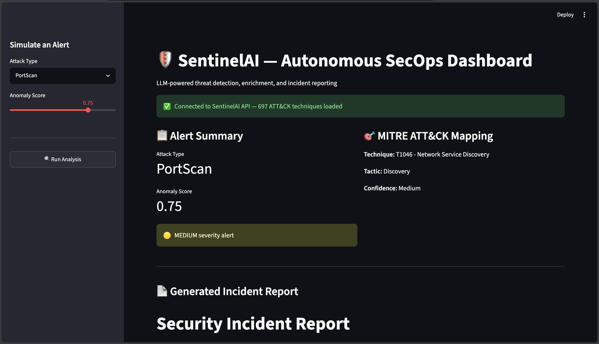
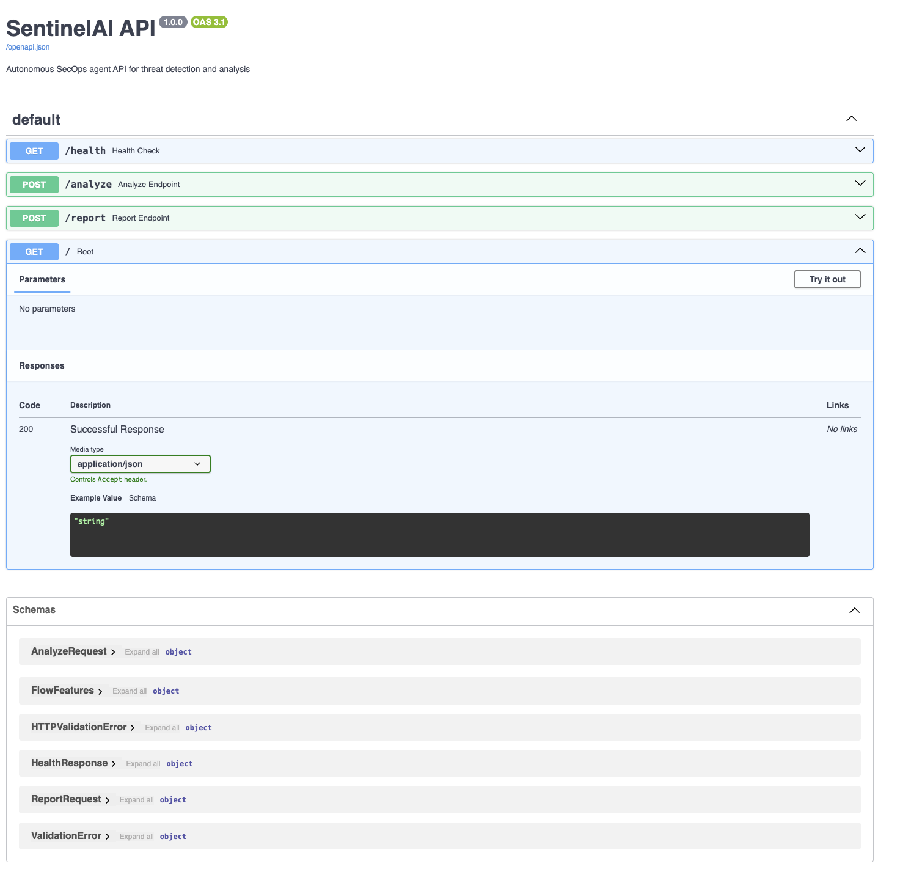
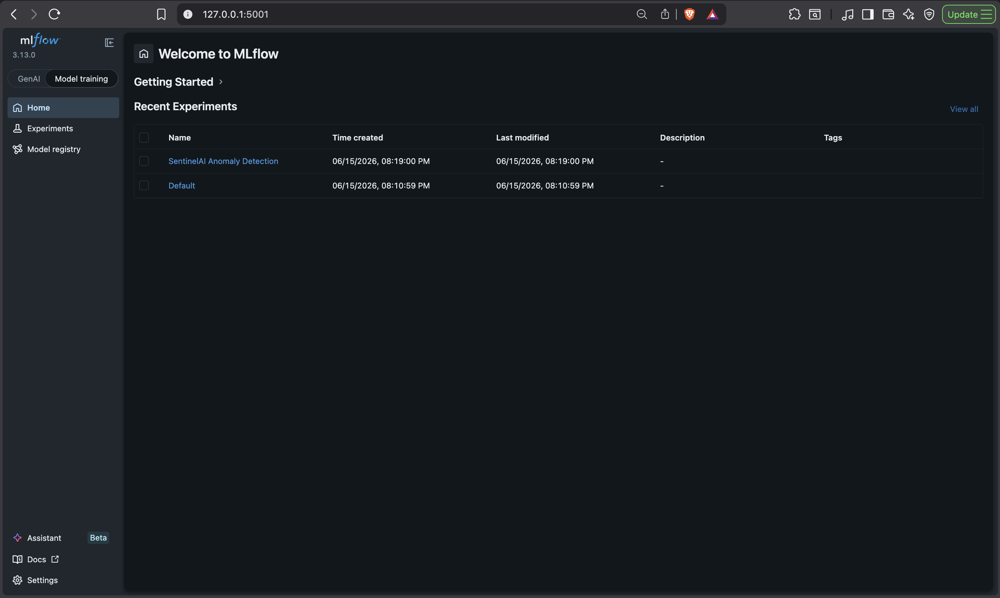

# 🛡️ SentinelAI — Autonomous SecOps Agent

SentinelAI is an end-to-end, LLM-powered security operations platform that detects network anomalies using machine learning, enriches them with real-time threat intelligence (MITRE ATT&CK + NVD/CVE), and uses an autonomous LLM agent to reason about incidents and generate structured security reports — all served through a REST API and an interactive dashboard.

This project was built to demonstrate the full lifecycle of a modern AI-augmented security tool: from raw network logs to ML-based detection, to LLM-based reasoning, to a deployable, containerized product.

---

## 🎯 Why This Project

Most ML portfolio projects stop at "I trained a model." Most LLM projects stop at "I built a chatbot." SentinelAI connects both: traditional ML anomaly detection feeding into an LLM agent that reasons about what the anomaly means, maps it to real attacker behavior (MITRE ATT&CK), and produces analyst-ready incident reports — the exact pattern emerging in real-world AI-augmented SOC tooling today.

---

## 🏗️ Architecture

```
┌─────────────┐     ┌──────────────────┐     ┌─────────────────┐
│  CICIDS-2017 │ --> │  ML Detection     │ --> │  LLM Agent       │
│  Network Logs│     │  (Isolation Forest│     │  (LangGraph +    │
│              │     │   + Autoencoder)  │     │   Claude/Ollama) │
└─────────────┘     └──────────────────┘     └────────┬─────────┘
                                                         │
                     ┌──────────────────────────────────┘
                     ▼
        ┌────────────────────────┐
        │  Threat Enrichment      │
        │  - MITRE ATT&CK (697    │
        │    techniques, RAG)     │
        │  - NVD CVE Lookup       │
        └────────────┬───────────┘
                      ▼
        ┌────────────────────────┐
        │  Structured Incident    │
        │  Report Generation      │
        └────────────┬───────────┘
                      ▼
        ┌─────────────────────────────────────┐
        │  FastAPI Backend  →  Streamlit Dashboard │
        └─────────────────────────────────────┘
```

---
## 📸 Screenshots

### Dashboard — Live Incident Report Generation


### FastAPI Interactive Docs


### MLflow Experiment Tracking


## 🧰 Tech Stack

| Layer | Technology |
|---|---|
| Anomaly Detection | scikit-learn (Isolation Forest), PyTorch (Autoencoder) |
| Experiment Tracking | MLflow |
| LLM Agent | LangGraph, LangChain, Claude API / Ollama (local dev) |
| Threat Intelligence | MITRE ATT&CK (full 697-technique dataset), NVD CVE API |
| RAG / Vector Search | ChromaDB, sentence-transformers |
| Backend | FastAPI |
| Frontend | Streamlit |
| Deployment | Docker, Docker Compose |
| Dataset | CICIDS-2017 (Canadian Institute for Cybersecurity) |

---

## 📊 Model Results

Both models were trained **unsupervised** (on benign traffic only) and calibrated using a small labeled sample to tune the decision threshold — no full labeled training set was used, reflecting realistic SOC conditions where attack examples are scarce.

| Model | Precision | Recall | F1 |
|---|---|---|---|
| Isolation Forest | 0.55 | 0.45 | 0.50 |
| Autoencoder | 0.99 | 0.37 | 0.53 |
| **Ensemble (AND logic)** | **0.99** | 0.36 | **0.52** |

**Key insight:** the two models have complementary failure modes — Isolation Forest casts a wider net (higher recall, more false positives), while the Autoencoder is highly precise (almost never wrong when it flags something, but conservative). The ensemble's AND logic produces a near-zero false-positive detector, prioritizing analyst trust over raw recall — a deliberate tradeoff for a SOC context where alert fatigue is a major real-world problem.

All experiments are tracked in MLflow with full metric and parameter logging.

---

## 🤖 The Agent in Action

Given a detected `SSH-Patator` anomaly, the agent:
1. Looks up the MITRE ATT&CK technique (T1110 — Brute Force)
2. Semantically searches the full ATT&CK corpus for related techniques (e.g. SSH Hijacking, Authorized Keys abuse)
3. Analyzes raw network flow features for corroborating signals
4. Synthesizes a structured incident report with severity, attacker goal, and remediation steps

See [`/docs`](#) for a live example, or run the dashboard locally to generate your own.

---

## 🚀 Running the Project

### Quickstart (Docker)

```bash
git clone https://github.com/MitGandhi4/SentinelAI.git
cd SentinelAI
docker compose up --build
```

Then visit:
- Dashboard: http://localhost:8501
- API docs: http://localhost:8000/docs
- MLflow: http://localhost:5001

### Manual Setup (Development)

```bash
python -m venv .venv
source .venv/bin/activate
pip install -r requirements.txt
```

Download the CICIDS-2017 dataset CSVs into `data/raw/`, and the MITRE ATT&CK enterprise dataset:

```bash
curl -o data/raw/enterprise-attack.json https://raw.githubusercontent.com/mitre/cti/master/enterprise-attack/enterprise-attack.json
```

Run the pipeline in order: `src/ingestion/loader.py` → `src/detection/isolation_forest.py` → `src/detection/autoencoder.py` → `src/detection/ensemble.py`, then start the API and dashboard.

**Note on LLM provider:** the agent defaults to local Ollama (`llama3.2`) for free development. To use Claude API instead, set `ANTHROPIC_API_KEY` in `.env` and swap the model initialization in `src/agent/agent.py`.

---

## 📁 Project Structure

```
sentinalai/
├── data/               # raw + processed log data, ATT&CK dataset
├── notebooks/          # EDA and exploration
├── src/
│   ├── ingestion/      # log parsing and cleaning
│   ├── detection/      # Isolation Forest + Autoencoder + ensemble
│   ├── enrichment/     # MITRE ATT&CK + CVE lookups, RAG pipeline
│   ├── agent/          # LangGraph agent + tools
│   ├── reporting/      # structured incident report generation
│   └── api/             # FastAPI backend
├── dashboard/           # Streamlit frontend
├── docker/              # Dockerfiles
├── docker-compose.yml
└── requirements.txt
```

---

## ⚠️ Known Limitations & Future Work

This is a portfolio project, and I want to be upfront about its current limitations:

- **Recall is moderate (~36-45%)** for the unsupervised models. A production system would likely use semi-supervised training with a larger labeled attack set, or active learning to incorporate analyst feedback over time.
- **MITRE ATT&CK label mapping** is currently a manually curated map from the 14 CICIDS attack types to specific technique IDs; the RAG layer searches the full 697-technique corpus, but the direct enrichment lookup covers only the techniques relevant to this dataset.
- **The LLM agent currently runs on Ollama (Llama 3.2)** for free local development. Tool-calling reliability with larger, more complex prompts is noticeably better with Claude API — this is a one-line swap (`src/agent/agent.py`) for production use.
- **No persistent log ingestion pipeline** (e.g. live Suricata/Zeek streaming) is implemented — the system currently operates on the static CICIDS-2017 dataset and simulated alerts via the dashboard, rather than a live traffic feed.
- **Elasticsearch integration**, originally planned for log storage at scale, was descoped in favor of finishing the full agent/reporting/deployment pipeline within project scope.

---

## 📝 License

MIT